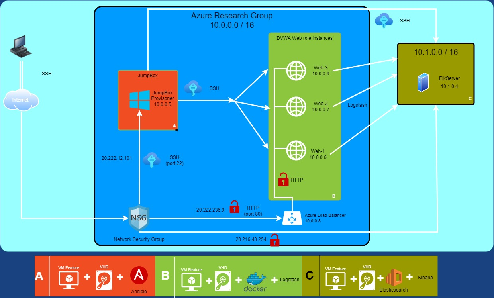
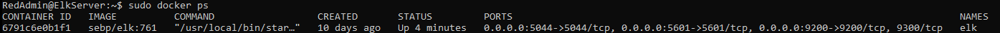

## Automated ELK Stack Deployment

The files in this repository were used to configure the network depicted below.

These files have been tested and used to generate a live ELK deployment on Azure. They can be used to either recreate the entire deployment pictured above. Alternatively, select portions of the yaml file may be used to install only certain pieces of it, such as Filebeat.
 
  ---
- name: Config Web VM with Docker
  hosts: webservers
  become: true
  tasks:
  - name: docker.io
    apt:
      force_apt_get: yes
      update_cache: yes
      name: docker.io
      state: present

  - name: Install pip3
    apt:
      force_apt_get: yes
      name: python3-pip
      state: present

  - name: Install Docker python module
    pip:
      name: docker
      state: present

  - name: download and launch a docker web container
    docker_container:
      name: dvwa
      image: cyberxsecurity/dvwa
      state: started
      published_ports: 80:80

  - name: Enable docker service
    systemd:
      name: docker
      enabled: yes
      
---
- name: Configure Elk VM with Docker
  hosts: elk
  remote_user: RedAdmin
  become: true
  tasks:
    # Use apt module
    - name: Install docker.io
      apt:
        update_cache: yes
        force_apt_get: yes
        name: docker.io
        state: present

      # Use apt module
    - name: Install python3-pip
      apt:
        force_apt_get: yes
        name: python3-pip
        state: present

      # Use pip module (It will default to pip3)
    - name: Install Docker module
      pip:
        name: docker
        state: present

      # Use command module
    - name: Increase virtual memory
      command: sysctl -w vm.max_map_count=262144

      # Use sysctl module
    - name: Use more memory
      sysctl:
        name: vm.max_map_count
        value: 262144
        state: present
        reload: yes

      # Use docker_container module
    - name: download and launch a docker elk container
      docker_container:
        name: elk
        image: sebp/elk:761
        state: started
        restart_policy: always
        # Please list the ports that ELK runs on
        published_ports:
          -  5601:5601
          -  9200:9200
          -  5044:5044

      # Use systemd module
    - name: Enable service docker on boot
      systemd:
        name: docker
        enabled: yes 

---
- name: installing and launching filebeat
  hosts: webservers
  become: yes
  tasks:

  - name: download filebeat deb
    command: curl -L -O https://artifacts.elastic.co/downloads/beats/filebeat/filebeat-7.4.0-amd64.deb

  - name: install filebeat deb
    command: dpkg -i filebeat-7.4.0-amd64.deb

  - name: drop in filebeat.yml
    copy:
      src: /etc/ansible/files/filebeat-config.yml
      dest: /etc/filebeat/filebeat.yml

  - name: enable and configure system module
    command: filebeat modules enable system

  - name: Setup filebeat
    command: filebeat setup

  - name: Start filebeat service
    command: service filebeat start

  - name: enable service filebeat on boot
    systemd:
      name: filebeat
      enabled: yes

---
- name: Installing Metricbeat
  hosts: webservers
  become: yes
  tasks:
    # Use command module
  - name: Download metricbeat .deb file
    command: curl -L -O https://artifacts.elastic.co/downloads/beats/metricbeat/metricbeat-7.6.1-amd64.deb

    # Use command module
  - name: Install metricbeat .deb
    command: dpkg -i metricbeat-7.6.1-amd64.deb

    # Use copy module
  - name: Drop in metricbeat.yml
    copy:
      src: /etc/ansible/files/metricbeat-config.yml
      dest: /etc/metricbeat/metricbeat.yml

    # Use command module
  - name: Enable and Configure System Module
    command: metricbeat modules enable docker

    # Use command module
  - name: Setup metricbeat
    command: metricbeat setup

    # Use command module
  - name: Start metricbeat service
    command: service metricbeat start

    # Use systemd module
  - name: Enable service metricbeat on boot
    systemd:
      name: metricbeat
      enabled: yes

This document contains the following details:
- Description of the Topology
- Access Policies
- ELK Configuration
  - Beats in Use
  - Machines Being Monitored
- How to Use the Ansible Build

### Description of the Topology

The main purpose of this network is to expose a load-balanced and monitored instance of DVWA, the D*mn Vulnerable Web Application.

Load balancing ensures that the application will be highly available, in addition to restricting access to the network.
- _TODO: What aspect of security do load balancers protect? What is the advantage of a jump box?_
Load balancers help protect against DDOS attacks by providing redundancy and fault tolerance. They also serve as a gateway address that outside sources have to access which
then forwards traffic to the machines behind it. This helps reduce the attack surface. 
The advantage of a jump box is that it provides a secure way to provide access in different security zones. It provides one means of access that can be
secured, monitored, and audited. 

Integrating an ELK server allows users to easily monitor the vulnerable VMs for changes to the data and system logs.
- Filebeat collects data about the file system.
- Metricbeat collects machine metrics, like uptime.

The configuration details of each machine may be found below.
_Note: Use the [Markdown Table Generator](http://www.tablesgenerator.com/markdown_tables) to add/remove values from the table_.

| Name      | Function   | IP Address | Operating System |
|-----------|------------|------------|------------------|
| Jump Box  | Gateway    | 10.0.0.5   | Linux            |
| Web-1     | Web Server | 10.0.0.6   | Linux            |
| Web-2     | Web Server | 10.0.0.7   | Linux            |
| Web-3     | Web Server | 10.0.0.9   | Linux            |
| ElkServer | Elk Stack  | 10.1.0.4   | Linux            |
### Access Policies

The machines on the internal network are not exposed to the public Internet. 

Only the Jump Box machine can accept connections from the Internet. Access to this machine is only allowed from the following IP addresses:
- User external IP address

Machines within the network can only be accessed by SSH.
- _TODO: Which machine did you allow to access your ELK VM? What was its IP address?_
JumpBox can access the ELK VM. Its IP address is 10.0.0.5.  

A summary of the access policies in place can be found in the table below.

| Name           | Publicly Accessible | Allowed IP Addresses                |
|----------------|---------------------|-------------------------------------|
| JumpBox-Access | No                  | 10.0.0.6 10.0.0.7 10.0.0.9 10.1.0.4 |
| Elk-Access     | Yes                 | User external IP address            |
| SSH            | Yes                 | User external IP address            |
| Port_80        | Yes                 | User external IP address            | 

### Elk Configuration

Ansible was used to automate configuration of the ELK machine. No configuration was performed manually, which is advantageous because...
there is a greatly reduced chance of human error and the ability to deploy many simultaneous machines at once if desired.

The playbook implements the following tasks:
- _TODO: In 3-5 bullets, explain the steps of the ELK installation play. E.g., install Docker; download image; etc._
- install Docker 
- install python3
- install Docker module
- set to use more memory
- download and launch docker elk container including setting ports and enabling on boot

The following screenshot displays the result of running `docker ps` after successfully configuring the ELK instance.

### Target Machines & Beats
This ELK server is configured to monitor the following machines:
Web-1 10.0.0.6
Web-2 10.0.0.7
Web-3 10.0.0.9

We have installed the following Beats on these machines:
Filebeat
Metricbeat

These Beats allow us to collect the following information from each machine:
- _TODO: In 1-2 sentences, explain what kind of data each beat collects, and provide 1 example of what you expect to see. E.g., `Winlogbeat` collects Windows logs, which we use to track user logon events, etc._
Filebeat collects information about the file system and sends the log files to Logstash and Elasticsearch. In this case it will be used to collect Apache server
and MySQL database logs from the DVWA instances.

### Using the Playbook
In order to use the playbook, you will need to have an Ansible control node already configured. Assuming you have such a control node provisioned: 

SSH into the control node and follow the steps below:
- Copy the _____ file to _____.
- Update the _____ file to include...
- Run the playbook, and navigate to http://ElkStackExternalIP:5601/app/kibana to check that the installation worked as expected.

_TODO: Answer the following questions to fill in the blanks:_
- _Which file is the playbook? Where do you copy it?_
- _Which file do you update to make Ansible run the playbook on a specific machine? How do I specify which machine to install the ELK server on versus which to install Filebeat on?_
- _Which URL do you navigate to in order to check that the ELK server is running?

_As a **Bonus**, provide the specific commands the user will need to run to download the playbook, update the files, etc._
